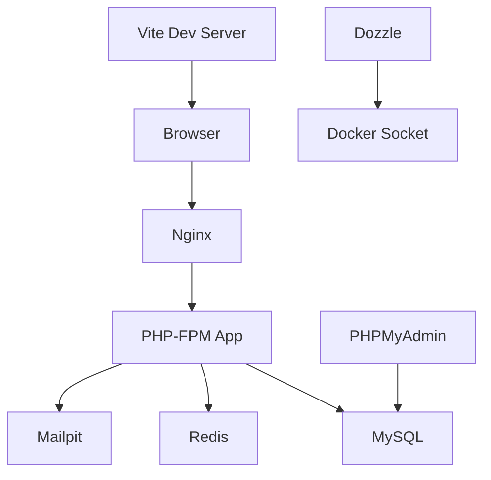

# PROJECT OVERVIEW

## 📋 Table of Contents

- [Project Description](#project-description)
- [Tech Stack](#tech-stack)
- [Architecture Overview](#architecture-overview)
- [Docker Services](#docker-services)
- [Backend Architecture](#backend-architecture)
- [Frontend Architecture](#frontend-architecture)
- [Multilanguage Support](#multilanguage-support)
- [API Documentation (Scribe)](#api-documentation-scribe)
- [Authentication & Authorization](#authentication--authorization)
- [Development Workflow](#development-workflow)
- [Environment Configuration](#environment-configuration)
- [Deployment](#deployment)

---

## 🎯 Project Description

A modern, full-stack CRUD application built with Laravel 12 and Vue 3, following best practices and design patterns. The application is fully containerized using Docker and includes comprehensive API documentation, multilanguage support, and a robust authentication system.

**Key Features:**
- ✅ RESTful API with comprehensive documentation
- ✅ Multilanguage support (English, Bangla)
- ✅ Token-based authentication (Laravel Sanctum)
- ✅ DTO (Data Transfer Object) + Action pattern
- ✅ Fully Dockerized environment
- ✅ Modern Vue 3 with Composition API
- ✅ Form handling with VForm
- ✅ Real-time email testing with Mailpit
- ✅ Container log monitoring with Dozzle
- ✅ Database management with phpMyAdmin

---

## 🛠 Tech Stack

### Backend
- **Framework:** Laravel 12 (PHP 8.4)
- **Authentication:** Laravel Sanctum
- **Database:** MySQL 8.0
- **Cache:** Redis 7
- **Image Processing:** Intervention Image
- **API Documentation:** Scribe
- **Background Jobs:** Laravel Horizon
- **Real-time:** Laravel Reverb
- **Testing:** PHPUnit, Laravel Debugbar

### Frontend
- **Framework:** Vue 3 (Composition API)
- **Build Tool:** Vite
- **Styling:** Tailwind CSS 4 with @tailwindcss/forms
- **HTTP Client:** Axios
- **Form Handling:** VForm
- **Internationalization:** laravel-vue-i18n
- **State Management:** Pinia
- **Date/Time:** Day.js, date-fns
- **Event Bus:** Mitt

### DevOps & Tools
- **Containerization:** Docker & Docker Compose
- **Web Server:** Nginx (Alpine)
- **Node.js:** Version 22 (Alpine)
- **Mail Testing:** Mailpit
- **Log Monitoring:** Dozzle
- **Database GUI:** phpMyAdmin

---

## 🏗 Architecture Overview

### Design Patterns

#### 1. **DTO (Data Transfer Object) Pattern**
DTOs are used to transfer data between layers, ensuring type safety and validation.

```php
// Example: UpdateProfileDTO
class UpdateProfileDTO
{
    public function __construct(
        public string $full_name,
        public ?string $language = null,
        public ?string $gender = null,
        public ?string $password = null,
        public ?string $avatar = null,
    ) {}
}
```

#### 2. **Action Pattern**
Business logic is encapsulated in Action classes, keeping controllers thin.

```php
// Example: UpdateProfileAction
class UpdateProfileAction
{
    public function execute(User $user, UpdateProfileDTO $dto): User
    {
        // Business logic here
        return $user;
    }
}
```

#### 3. **Repository Pattern**
Data access logic is abstracted through repositories (used selectively).

#### 4. **Service Pattern**
Complex operations are handled by service classes.

### Project Structure

```
.
├── app/
│   ├── Actions/              # Business logic actions
│   ├── DataTransferObjects/  # DTOs for data transfer
│   ├── Enums/               # Application enums
│   ├── Http/
│   │   ├── Controllers/     # API controllers
│   │   ├── Middleware/      # Custom middleware
│   │   ├── Requests/        # Form request validation
│   │   └── Resources/       # API resources
│   ├── Models/              # Eloquent models
│   └── Traits/              # Reusable traits
├── database/
│   ├── migrations/          # Database migrations
│   └── seeders/             # Database seeders
├── resources/
│   ├── js/                  # Vue.js application
│   │   ├── components/      # Vue components
│   │   ├── composables/     # Composition API composables
│   │   ├── layouts/         # Layout components
│   │   ├── pages/           # Page components
│   │   ├── router/          # Vue Router configuration
│   │   ├── stores/          # Pinia stores
│   │   └── utils/           # Utility functions
│   ├── lang/                # Translation files
│   └── views/               # Blade templates
├── routes/
│   ├── api.php              # API routes
│   ├── api/v1/              # Versioned API routes
│   └── web.php              # Web routes
└── .docker/                 # Docker configuration files
```

---

## 🐳 Docker Services

### Service Architecture



### Services Configuration

| Service | Container Name | Purpose | Ports | Health Check |
|---------|---------------|---------|-------|--------------|
| **nginx** | crud_nginx | Web server (serves Laravel public/) | 8000:80 | - |
| **app** | crud_app | PHP-FPM 8.4 runtime | 9000 (internal) | - |
| **mysql** | crud_mysql | MySQL 8.0 database | 3307:3306 | mysqladmin ping |
| **redis** | crud_redis | Cache & session store | 6379 (internal) | - |
| **node** | crud_node | Vite dev server | 5173:5173 | - |
| **phpmyadmin** | crud_phpmyadmin | Database management UI | 8080:80 | - |
| **mailpit** | crud_mailpit | Email testing (SMTP + Web UI) | 8025:8025, 1025:1025 | - |
| **dozzle** | crud_dozzle | Real-time container logs viewer | 8890:8080 | - |

### Access Points

- **Application (Laravel):** http://localhost:8000
- **Frontend Dev Server (Vite):** http://localhost:5173
- **phpMyAdmin:** http://localhost:8080
- **Mailpit Web UI:** http://localhost:8025
- **Dozzle (Logs):** http://localhost:8890
- **API Documentation:** http://localhost:8000/docs
- **MySQL Direct Connection:** localhost:3307

### Docker Commands

```bash
# Start all services
docker compose up -d

# View logs
docker compose logs -f [service_name]

# Stop all services
docker compose down

# Rebuild services
docker compose up -d --build

# Execute commands in app container
docker compose exec app bash
docker compose exec app php artisan migrate
docker compose exec app php artisan optimize:clear

# Access MySQL CLI
docker compose exec mysql mysql -u crud_user -psecret crud_db
```

### Volume Management

- **mysql_data:** Persistent MySQL data
- **redis_data:** Persistent Redis data
- **node_modules:** Cached Node.js dependencies

---

## 🔧 Backend Architecture

### API Structure

All API routes are versioned and prefixed with `/api/v1/`:

```
/api/v1/
├── admin/              # Admin routes
│   ├── login          # POST - User login
│   ├── register       # POST - User registration
│   ├── logout         # POST - User logout (auth required)
│   ├── user-details   # GET - Get authenticated user (auth required)
│   ├── update-profile # PUT - Update profile with avatar (auth required)
│   └── change-password # PUT - Change password (auth required)
├── enums/             # Enum endpoints
│   └── gender         # GET - Get gender options
└── health             # GET - Health check endpoint
```

### Route Organization

```php
// routes/api.php
Route::prefix('v1')->group(function () {
    // Health check
    Route::get('health', [HealthController::class, 'health']);
    
    // Enums
    Route::prefix('enums')->group(function () {
        Route::get('gender', [EnumController::class, 'gender']);
    });
    
    // Admin routes
    Route::prefix('admin')->group(function () {
        // Public routes (without auth)
        require __DIR__ . '/api/v1/admin/without_authentication.php';
        
        // Protected routes (with auth)
        require __DIR__ . '/api/v1/admin/auth.php';
    });
});
```

### Request Validation

All requests use Form Request classes with custom validation rules:

```php
// app/Http/Requests/Api/Auth/UpdateProfileRequest.php
public function rules(): array
{
    return [
        'full_name' => 'required|string|min:2|max:255',
        'password' => 'nullable|string|min:8|confirmed',
        'language' => 'nullable|string|in:' . implode(',', array_column(AppLanguageEnum::cases(), 'value')),
        'gender' => 'nullable|string|in:' . implode(',', array_column(UserGenderEnum::cases(), 'value')),
        'avatar' => 'nullable|image|mimes:jpeg,png,jpg|max:20480',
    ];
}

// Scribe documentation support
public function bodyParameters(): array
{
    return [
        'full_name' => [
            'description' => 'Full name of the user',
            'example' => 'John Doe',
        ],
        // ... more parameters
    ];
}
```

### Response Format

All API responses follow a consistent format using helper functions:

```php
// Success response
success_response($data, $is_data = true, $message = 'success')
// Returns:
{
    "success": true,
    "message": "success",
    "data": { ... }
}

// Error response
error_response($message, $status_code = 400, $data = [])
// Returns:
{
    "success": false,
    "message": "error_message",
    "data": []
}
```

### File Upload Handling

The `UploadAble` trait provides consistent file upload functionality:

```php
trait UploadAble
{
    protected function uploadFile(
        UploadedFile $file,
        string $directory,
        string $disk = 'public',
        ?string $filename = null,
        array $options = []
    ): string
    {
        // Handles image resizing, quality optimization
        // Returns stored file path
    }
}
```

### Enums

Application uses PHP 8.4 enums for type safety:

```php
// AppLanguageEnum
enum AppLanguageEnum: string
{
    case EN = 'en';
    case BN = 'bn';
    
    public function label(): string
    {
        return match ($this) {
            self::EN => 'English',
            self::BN => 'Bangla',
        };
    }
}

// UserGenderEnum
enum UserGenderEnum: string
{
    case MALE = 'male';
    case FEMALE = 'female';
    case OTHER = 'other';
}
```

---

## 🎨 Frontend Architecture

### Vue 3 Structure

The frontend uses Vue 3 with Composition API and script setup syntax:

```vue
<script setup>
import { ref, onMounted } from 'vue';
import { useI18n } from 'vue-i18n';

const { t } = useI18n();
const data = ref([]);

onMounted(async () => {
    // Component logic
});
</script>

<template>
    <!-- Template -->
</template>
```

### Form Handling with VForm

VForm simplifies form submissions and validation:

```vue
<script setup>
import Form from 'vform';

const form = new Form({
    full_name: '',
    email: '',
    password: '',
    password_confirmation: ''
});

const submit = async () => {
    try {
        const response = await form.post('/v1/admin/register');
        // Handle success
    } catch (error) {
        // Errors are automatically handled by VForm
    }
};
</script>
```

**VForm Features:**
- Automatic error handling
- Built-in loading states
- File upload support
- Error display per field
- Automatic form reset

### Component Library

#### 1. **TextInput Component**
Reusable input with built-in validation:

```vue
<TextInput
    v-model="form.email"
    name="email"
    type="email"
    :label="t('email')"
    :placeholder="t('enter_email')"
    :required="true"
    :error="form.errors.get('email')"
/>
```

**Props:**
- `required`, `minLength`, `maxLength`
- `email`, `password`, `number`
- `error` - External error message
- Auto-validates on blur

#### 2. **SingleSelect Component**
Dropdown with API endpoint support:

```vue
<SingleSelect
    v-model="form.gender"
    name="gender"
    :label="t('gender')"
    :placeholder="t('select_gender')"
    :options="genderOptions"
    :endpoint="'v1/enums/gender'"
    :searchable="false"
/>
```

**Features:**
- Static options or API endpoint
- Searchable dropdown
- Disabled state
- Auto-fetches data from API

### Axios Configuration

Custom axios instance with interceptors:

```javascript
// resources/js/axios.js
axios.defaults.baseURL = '/api';
axios.defaults.headers.common = { Accept: 'application/json' };

// Request interceptor - adds language header
axios.interceptors.request.use(config => {
    const lang = localStorage.getItem('language') || 'en';
    config.headers['language'] = lang;
    return config;
});

// Response interceptor - handles errors globally
axios.interceptors.response.use(
    response => response,
    error => {
        // Global error handling
        notify.error(trans(error.response?.data?.message || 'error'));
        return Promise.reject(error);
    }
);
```

### State Management (Pinia)

```javascript
// stores/auth.js
import { defineStore } from 'pinia';

export const useAuthStore = defineStore('auth', {
    state: () => ({
        user: null,
        token: localStorage.getItem('token') || null,
    }),
    
    actions: {
        async login(credentials) {
            const response = await axios.post('/v1/admin/login', credentials);
            this.setAuth(response.data.data);
        },
        
        setAuth(data) {
            this.user = data.user;
            this.token = data.access_token;
            localStorage.setItem('token', data.access_token);
            axios.defaults.headers.common['Authorization'] = `Bearer ${data.access_token}`;
        },
        
        logout() {
            this.user = null;
            this.token = null;
            localStorage.removeItem('token');
            delete axios.defaults.headers.common['Authorization'];
        }
    }
});
```

---

## 🌍 Multilanguage Support

### Backend Implementation

#### 1. **Language Middleware**

All API requests MUST include a `language` header:

```php
// app/Http/Middleware/LanguageMiddleware.php
class LanguageMiddleware
{
    public function handle(Request $request, Closure $next)
    {
        $lang = $request->header('language');
        
        if (!$request->hasHeader('language') || empty($lang)) {
            return response()->json([
                'success' => false,
                'message' => 'missing_required_language_in_header',
            ], 422);
        }
        
        app()->singleton('language', fn() => $lang);
        app()->setLocale($lang);
        
        return $next($request);
    }
}
```

#### 2. **Translation Files**

```
resources/lang/
├── en.json          # English translations
└── bn.json          # Bangla translations
```

Example translations:

```json
// en.json
{
    "login_successful": "Login successful",
    "invalid_credentials": "Invalid email or password",
    "field_input_is_missing": "This field is required"
}

// bn.json
{
    "login_successful": "লগইন সফল হয়েছে",
    "invalid_credentials": "ইমেইল বা পাসওয়ার্ড ভুল",
    "field_input_is_missing": "এই ফিল্ডটি আবশ্যক"
}
```

### Frontend Implementation

#### 1. **laravel-vue-i18n**

```javascript
// main.js
import { i18nVue } from 'laravel-vue-i18n';

app.use(i18nVue, {
    resolve: async lang => {
        const langs = import.meta.glob('../../lang/*.json');
        return await langs[`../../lang/${lang}.json`]();
    },
});
```

#### 2. **Usage in Components**

```vue
<script setup>
import { trans } from 'laravel-vue-i18n';

const message = trans('login_successful');
</script>

<template>
    <h1>{{ trans('welcome') }}</h1>
    <p>{{ $t('description') }}</p>
</template>
```

#### 3. **Language Switching**

```javascript
// composables/useLanguage.js
export function useLanguage() {
    const currentLanguage = ref(localStorage.getItem('language') || 'en');
    
    const changeLanguage = (lang) => {
        currentLanguage.value = lang;
        localStorage.setItem('language', lang);
        // Axios interceptor automatically adds language header
        location.reload(); // Reload to apply translations
    };
    
    return { currentLanguage, changeLanguage };
}
```

### Supported Languages

| Code | Language | Label |
|------|----------|-------|
| `en` | English | English |
| `bn` | Bangla | বাংলা |

**Adding New Languages:**

1. Add enum case in `AppLanguageEnum.php`
2. Create translation file in `resources/lang/`
3. Update language switcher UI
4. Test all translations

---

## 📚 API Documentation (Scribe)

### Overview

Scribe automatically generates beautiful, interactive API documentation from your code annotations.

**Access:** http://localhost:8000/docs

### Configuration

```php
// config/scribe.php
return [
    'title' => config('app.name') . ' API Documentation',
    'description' => 'This documentation is for general API routes.',
    'base_url' => config('app.url'),
    
    'type' => 'laravel', // Generates as Blade view
    'theme' => 'elements', // Modern theme
    
    'routes' => [
        [
            'match' => [
                'prefixes' => ['api/*'],
                'domains' => ['*'],
            ],
            'exclude' => [
                'api/mobile/*', // Exclude mobile API
            ],
        ],
    ],
    
    'auth' => [
        'enabled' => true,
        'in' => 'bearer', // Bearer token authentication
    ],
];
```

### Documentation Annotations

#### Controller Level

```php
/**
 * @group Auth
 */
class AuthController extends Controller
{
    /**
     * Login
     * 
     * Authenticate user with email and password, returns access token.
     * 
     * @unauthenticated
     * 
     * @response 200 scenario="Successful login" {
     *   "success": true,
     *   "message": "success",
     *   "data": {
     *     "message": "login_successful",
     *     "access_token": "1|token...",
     *     "token_type": "Bearer",
     *     "user": { ... }
     *   }
     * }
     * 
     * @response 401 scenario="Invalid credentials" {
     *   "success": false,
     *   "message": "invalid_credentials"
     * }
     */
    public function login(LoginRequest $request) { }
}
```

#### Request Level (Form Requests)

```php
class UpdateProfileRequest extends FormRequest
{
    public function bodyParameters(): array
    {
        return [
            'full_name' => [
                'description' => 'Full name of the user',
                'example' => 'John Doe',
            ],
            'avatar' => [
                'description' => 'Avatar image (JPEG, PNG - max 20MB)',
                'type' => 'file', // Important for file uploads
            ],
        ];
    }
}
```

### Generating Documentation

```bash
# Generate API documentation
docker compose exec app php artisan scribe:generate

# Or use alias (if configured)
paapidocs
```

**Generated Files:**
- `resources/views/scribe/index.blade.php` - Main documentation view
- `.scribe/` - Source markdown files (gitignored)

### Best Practices

1. **Always document:**
   - Request parameters
   - Response formats
   - Error scenarios
   - Authentication requirements

2. **Use @group for organization:**
   - Auth
   - Tasks
   - Enums
   - Admin

3. **File uploads require `type: 'file'`:**
   ```php
   'avatar' => [
       'description' => 'User avatar',
       'type' => 'file',
   ]
   ```

4. **Mark public endpoints as `@unauthenticated`**

5. **Provide realistic examples**

---

## 🔐 Authentication & Authorization

### Laravel Sanctum

Token-based authentication using Laravel Sanctum:

#### 1. **Configuration**

```php
// config/sanctum.php
'expiration' => null, // Tokens don't expire
'middleware' => [
    'verify_csrf_token' => false,
    'encrypt_cookies' => false,
],
```

#### 2. **Authentication Flow**

```php
// Login
public function login(LoginRequest $request)
{
    $credentials = $request->only('email', 'password');
    
    if (!Auth::attempt($credentials)) {
        return error_response('invalid_credentials', 401);
    }
    
    $user = Auth::user();
    $token = $user->createToken('admin')->plainTextToken;
    
    return success_response([
        'access_token' => $token,
        'token_type' => 'Bearer',
        'user' => new UserResource($user),
    ]);
}

// Logout
public function logout(Request $request)
{
    $request->user()->currentAccessToken()->delete();
    return success_response([], false, 'logged_out');
}
```

#### 3. **Protected Routes**

```php
// routes/api/v1/admin/auth.php
Route::middleware('auth:sanctum')->group(function () {
    Route::post('logout', [AuthController::class, 'logout'])->name('logout');
    Route::get('user-details', [AuthController::class, 'me'])->name('me');
    Route::put('update-profile', [AuthController::class, 'updateProfile'])->name('update-profile');
    Route::put('change-password', [AuthController::class, 'changePassword'])->name('change-password');
});
```

#### 4. **Frontend Integration**

```javascript
// Login
const login = async (credentials) => {
    const response = await form.post('/v1/admin/login');
    const { access_token, user } = response.data.data;
    
    // Store token
    localStorage.setItem('token', access_token);
    
    // Set axios default header
    axios.defaults.headers.common['Authorization'] = `Bearer ${access_token}`;
    
    // Navigate to dashboard
    router.push('/dashboard');
};

// Add token to all requests
axios.interceptors.request.use(config => {
    const token = localStorage.getItem('token');
    if (token) {
        config.headers.Authorization = `Bearer ${token}`;
    }
    return config;
});
```

### Route Protection

Frontend routes are protected using Vue Router navigation guards:

```javascript
// router/index.js
router.beforeEach((to, from, next) => {
    const token = localStorage.getItem('token');
    const requiresAuth = to.matched.some(record => record.meta.requiresAuth);
    
    if (requiresAuth && !token) {
        next('/login');
    } else if (to.path === '/login' && token) {
        next('/dashboard');
    } else {
        next();
    }
});
```

---

## 💻 Development Workflow

### Initial Setup

```bash
# 1. Clone repository
git clone <repository-url>
cd simple-crud-vue

# 2. Copy environment file
cp .env.example .env

# 3. Start Docker services
docker compose up -d

# 4. Install PHP dependencies
docker compose exec app composer install

# 5. Generate application key
docker compose exec app php artisan key:generate

# 6. Run migrations
docker compose exec app php artisan migrate

# 7. Seed database (optional)
docker compose exec app php artisan db:seed

# 8. Install Node dependencies (runs automatically in node container)
# Or manually: docker compose exec node npm install

# 9. Generate API documentation
docker compose exec app php artisan scribe:generate
```

### Daily Development

```bash
# Start services
docker compose up -d

# View logs
docker compose logs -f app
docker compose logs -f node

# Access application shell
docker compose exec app bash

# Run artisan commands
docker compose exec app php artisan migrate
docker compose exec app php artisan optimize:clear
docker compose exec app php artisan route:list

# Run tests
docker compose exec app php artisan test

# Stop services
docker compose down
```

### Database Management

```bash
# Create migration
docker compose exec app php artisan make:migration create_posts_table

# Run migrations
docker compose exec app php artisan migrate

# Rollback migrations
docker compose exec app php artisan migrate:rollback

# Fresh migration with seeding
docker compose exec app php artisan migrate:fresh --seed

# Access MySQL CLI
docker compose exec mysql mysql -u crud_user -psecret crud_db

# Or use phpMyAdmin
# http://localhost:8080
```

### Frontend Development

```bash
# Node container runs Vite automatically
# Access at: http://localhost:5173

# Rebuild node modules
docker compose exec node npm install

# Build for production
docker compose exec node npm run build

# Clear Vite cache
docker compose exec node rm -rf node_modules/.vite
```

### Debugging

#### Backend
- **Laravel Debugbar:** Enabled in development
- **Logs:** `storage/logs/laravel.log`
- **Query Log:** Enable in `.env`: `DB_LOG=true`

#### Frontend
- **Vue DevTools:** Install browser extension
- **Console Logs:** Check browser console
- **Network Tab:** Monitor API requests

#### Container Logs
- **Dozzle:** http://localhost:8890 (visual log viewer)
- **Docker logs:** `docker compose logs -f [service]`

### Code Quality

```bash
# PHP Code Style (if configured)
docker compose exec app ./vendor/bin/pint

# PHP Static Analysis (if configured)
docker compose exec app ./vendor/bin/phpstan analyse

# Frontend Linting
docker compose exec node npm run lint
```

---

## ⚙️ Environment Configuration

### .env File Structure

```env
# Application
APP_NAME="CRUD App"
APP_ENV=local
APP_KEY=base64:...
APP_DEBUG=true
APP_URL=http://localhost:8000

# Database
DB_CONNECTION=mysql
DB_HOST=mysql
DB_PORT=3306
DB_DATABASE=crud_db
DB_USERNAME=crud_user
DB_PASSWORD=secret

# Cache & Session
CACHE_DRIVER=redis
SESSION_DRIVER=redis
QUEUE_CONNECTION=redis

REDIS_HOST=redis
REDIS_PASSWORD=null
REDIS_PORT=6379

# Mail (Mailpit)
MAIL_MAILER=smtp
MAIL_HOST=mailpit
MAIL_PORT=1025
MAIL_USERNAME=null
MAIL_PASSWORD=null
MAIL_ENCRYPTION=null

# Sanctum
SANCTUM_STATEFUL_DOMAINS=localhost:8000,localhost:5173

# Scribe
SCRIBE_ENABLED=true
```

### Configuration Files

| File | Purpose |
|------|---------|
| `config/app.php` | Application settings, timezone, locale |
| `config/database.php` | Database connections |
| `config/sanctum.php` | API authentication |
| `config/scribe.php` | API documentation |
| `config/cors.php` | CORS policy |
| `config/filesystems.php` | Storage configuration |

---

## 🚀 Deployment

### Production Checklist

- [ ] Set `APP_ENV=production`
- [ ] Set `APP_DEBUG=false`
- [ ] Configure production database
- [ ] Set secure `APP_KEY`
- [ ] Configure mail service (not Mailpit)
- [ ] Set up SSL/HTTPS
- [ ] Configure file storage (S3, etc.)
- [ ] Set up queue workers (Horizon)
- [ ] Configure Redis for caching
- [ ] Enable production logging
- [ ] Build frontend assets: `npm run build`
- [ ] Optimize Laravel: `php artisan optimize`
- [ ] Generate API docs: `php artisan scribe:generate`
- [ ] Set up monitoring (error tracking, logs)

### Build Commands

```bash
# Backend optimization
php artisan config:cache
php artisan route:cache
php artisan view:cache
php artisan optimize

# Frontend build
npm run build

# Clear all caches
php artisan optimize:clear
```

### Production Docker

Modify `docker-compose.yml` for production:

1. Remove development services (Mailpit, Dozzle, phpMyAdmin)
2. Use environment-specific `.env` files
3. Set up proper volumes for persistent data
4. Configure reverse proxy (Traefik, Nginx Proxy)
5. Enable HTTPS with Let's Encrypt
6. Set up automated backups

### Monitoring

- **Application Logs:** Laravel Telescope (production alternative)
- **Server Logs:** ELK Stack, Papertrail
- **Error Tracking:** Sentry, Bugsnag
- **Performance:** New Relic, Datadog
- **Uptime:** UptimeRobot, Pingdom

---

## 📝 Additional Notes

### Helper Functions

```php
// Response helpers
success_response($data, $is_data = true, $message = 'success')
error_response($message, $status_code = 400, $data = [])

// Translation helper
trans('key', ['param' => 'value'], 'en')
```

### Custom Artisan Commands

Create custom commands for common tasks:

```bash
# Create command
php artisan make:command GenerateApiDocs

# Run command
php artisan app:generate-api-docs
```

### Best Practices

1. **Always use DTOs** for data transfer between layers
2. **Keep controllers thin** - business logic in Actions
3. **Validate in Form Requests** - not in controllers
4. **Use API Resources** for response transformation
5. **Document all endpoints** with Scribe annotations
6. **Test API endpoints** - write feature tests
7. **Use enums** for fixed values
8. **Implement soft deletes** where appropriate
9. **Version your API** - currently `/api/v1/`
10. **Follow PSR standards** for PHP code

---

## 🤝 Contributing

1. Follow existing code structure and patterns
2. Write descriptive commit messages
3. Update documentation for new features
4. Add Scribe annotations for new endpoints
5. Test thoroughly before committing
6. Keep Docker services updated

---

## 📞 Support & Resources

- **Laravel Documentation:** https://laravel.com/docs
- **Vue 3 Documentation:** https://vuejs.org/guide
- **Scribe Documentation:** https://scribe.knuckles.wtf
- **Docker Documentation:** https://docs.docker.com
- **Tailwind CSS:** https://tailwindcss.com/docs

---

**Last Updated:** December 9, 2025  
**Version:** 1.0.0  
**Maintainer:** Development Team
